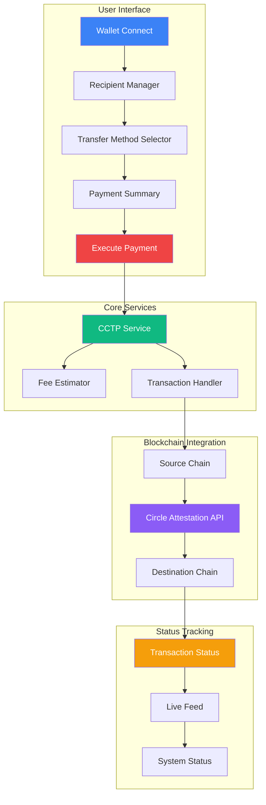

# Team Pay - Cross-Chain USDC Payment Platform

<div align="center">


**Streamlined Cross-Chain USDC Bulk Payments with Circle's CCTP**

[](https://vercel.com)
[](https://reactjs.org/)
[](https://www.typescriptlang.org/)
[](https://www.circle.com/en/cross-chain-transfer-protocol)
</div>

## 🔍 The Problem

Organizations and DAOs face significant challenges when making bulk payments across different blockchain networks:

- **Complex Operations**: Handling multiple transactions across chains requires technical expertise
- **Time Consumption**: Manual transfers are time-intensive and error-prone
- **High Costs**: Individual transfers accumulate unnecessary gas fees and network costs
- **Fragmented Experience**: Different wallets and interfaces for each chain create friction
- **Limited Tracking**: No consolidated view of cross-chain payment status
- **Security Concerns**: Manual processes increase the risk of errors and losses

## 💡 The Solution

Team Pay streamlines the process of sending USDC payments to multiple recipients across different blockchain networks:

- **Unified Interface**: Manage all cross-chain transfers from a single dashboard
- **Batch Processing**: Send to multiple recipients with one approval flow
- **Cost Optimization**: Reduce gas fees through optimized transaction batching
- **Real-time Tracking**: Monitor transaction status across all chains
- **Flexible Transfer Options**: Choose between speed (Fast Transfer) and cost (Standard Transfer)
- **Enhanced Security**: Reduced manual steps minimize human error
- **Regulatory Compliance**: Leveraging Circle's compliant USDC infrastructure

## 🚀 Key Features

- **Multi-Chain Support**: Transfer USDC across 7 major networks
- **Bulk Transfers**: Send to multiple recipients in one operation
- **CSV Import**: Upload recipient lists from spreadsheets
- **Fee Estimation**: Preview costs before committing
- **Transaction Monitoring**: Real-time status tracking
- **Network Detection**: Automatic chain identification
- **Speed Options**: Fast (8-20s) or Standard (13-19m) transfers
- **Balance Management**: Real-time USDC balance display
- **History & Reporting**: Complete transaction audit trail

## 🔄 System Architecture Diagram



## 💻 Tech Stack

### Frontend
- **Framework**: React 18 with TypeScript
- **State Management**: Zustand with persistence
- **UI Components**: Radix UI + Tailwind CSS
- **Data Fetching**: TanStack Query
- **Routing**: Wouter
- **Forms**: React Hook Form + Zod validation

### Blockchain Integration
- **CCTP Protocol**: Circle's Cross-Chain Transfer Protocol V2
- **Wallet Connection**: MetaMask/Web3 providers
- **Contract Interaction**: ethers.js v6
- **Networks**: Ethereum, Polygon, Arbitrum, Base, Optimism, Avalanche, Linea

### Backend (Serverless)
- **API Routes**: Express.js with TypeScript
- **Database**: PostgreSQL with Drizzle ORM
- **Authentication**: Session-based with passport.js
- **Storage**: Memorystore for session persistence
- **Deployment**: Vercel Edge Functions

## 🌐 Supported Networks

### Mainnet
- Ethereum (CCTP domain 0)
- Polygon (CCTP domain 7)
- Arbitrum (CCTP domain 3)
- Base (CCTP domain 6)
- Optimism (CCTP domain 2)
- Avalanche (CCTP domain 1)
- Linea (CCTP domain 9)

### Testnet
- Sepolia (CCTP domain 0)
- Arbitrum Sepolia (CCTP domain 3)
- Base Sepolia (CCTP domain 6)
- Avalanche Fuji (CCTP domain 1)
- OP Sepolia (CCTP domain 2)
- Polygon Amoy (CCTP domain 7)
- Linea Sepolia (CCTP domain 9)
- Sonic Testnet (CCTP domain 10)
- Unichain Sepolia (CCTP domain 11)
- World Chain Sepolia (CCTP domain 12)

## 🔮 Future Integrations

### LiFi Integration
The roadmap includes integration with LiFi protocol to:
- **Expand Network Support**: Support for 30+ blockchain networks
- **Cross-Asset Swaps**: Convert between different assets during transfers
- **Route Optimization**: Automatically find the most efficient transfer paths
- **DEX Aggregation**: Access to better rates through multiple liquidity sources
- **API Integration**: Seamless connection to LiFi's cross-chain infrastructure

### MetaMask Card Integration
Future support for MetaMask Card will enable:
- **Fiat On/Off Ramps**: Direct conversion between USDC and local currencies
- **Physical Card Payments**: Spend USDC at retail locations
- **Card Management**: Issue and manage team payment cards
- **Spending Controls**: Set limits and controls for team members
- **Transaction Reconciliation**: Automatic tracking of card expenses

## 🚀 Getting Started

### Prerequisites
- Node.js 18+ and npm
- MetaMask or compatible Web3 wallet
- USDC on supported networks

### Installation

```bash
# Clone the repository
git clone https://github.com/Rakesh-ada/team-pay.git
cd team-pay

# Install dependencies
npm install

# Create .env file
cp .env.example .env
# Update .env with your values

# Start development server
npm run dev
```

### Deployment to Vercel

This project is configured for easy deployment to Vercel.

[](https://vercel.com/new/clone?repository-url=https%3A%2F%2Fgithub.com%2FRakesh-ada%2Fteam-pay)

## 📋 Usage Flow

1. **Connect Wallet**: Link your MetaMask or Web3 wallet
2. **Add Recipients**: Enter addresses, select chains, and specify amounts
3. **Select Transfer Method**: Choose Fast or Standard transfer
4. **Review Summary**: Check recipient details and fee estimates
5. **Execute Payment**: Approve and monitor transaction progress
6. **Verify Results**: Confirm successful payments in the transaction log

## 📝 License

MIT

## 🙏 Acknowledgements

- [Circle CCTP Documentation](https://developers.circle.com/stablecoins/docs/cctp-getting-started)
- [Radix UI Component Library](https://www.radix-ui.com/)
- [Ethers.js Documentation](https://docs.ethers.org/v6/)
- [Vercel Platform](https://vercel.com/)